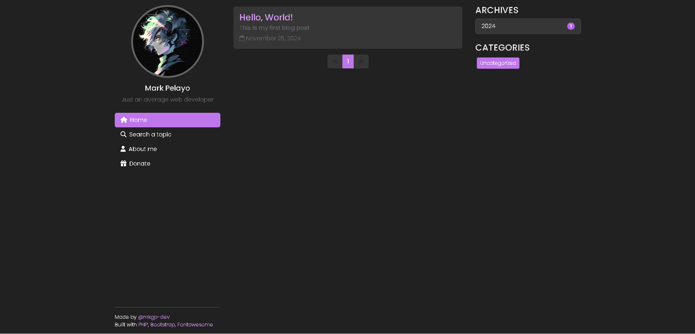
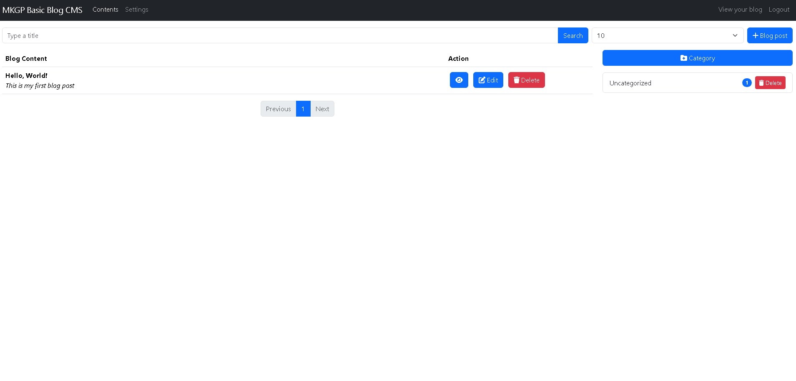

# Blog Portfolio PHP

Blog PHP integrated with your portfolio

## Features

- Blog CMS
- Portfolio

## Preview

## Used in development

 - **PHP** for modules, routing
 - **Javascript** for calling APIs
 - **SQLite3** for storing local database
 - **[Bootstrap](https://getbootstrap.com/)** for theme
 - **[Fontawesome](https://fontawesome.com/)** for icons
 - **[Quill](https://quilljs.com/)** for WYSIWYG HTML Editor
 - **[Uniform Server](https://www.uniformserver.com/)** for local hosting

## FAQ

#### Can I use this project?

Of course! just leave my mark, fork this repository and surely you wouldn't mind to hit that star.

#### Where can I access your CMS?

You can access it with `/dashboard/`. Your login will be based of what you have set in `index.php`.

#### How to reset everthing?

Go to `db_sqlite3` folder and delete `default.db`.
## Feedback

There's a room for improvement with this project of mine so if you have any issues, just create an issue in this repository.
## Authors

- [@mkgp-dev](https://github.com/mkgp-dev/)

